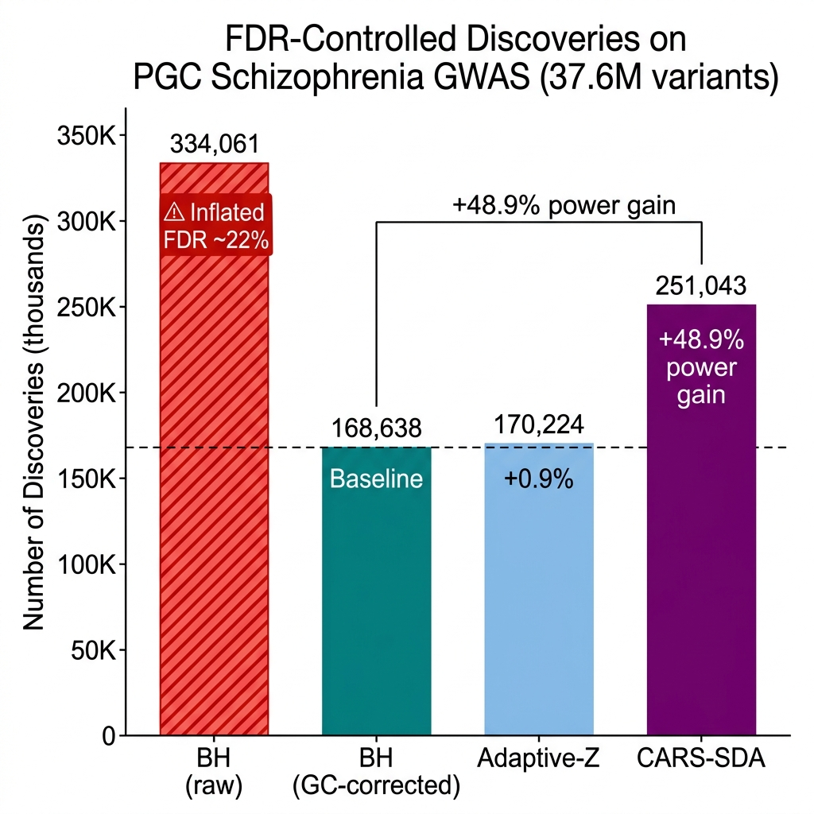
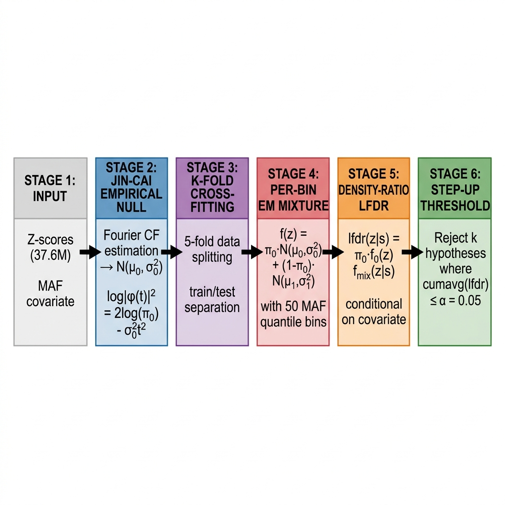
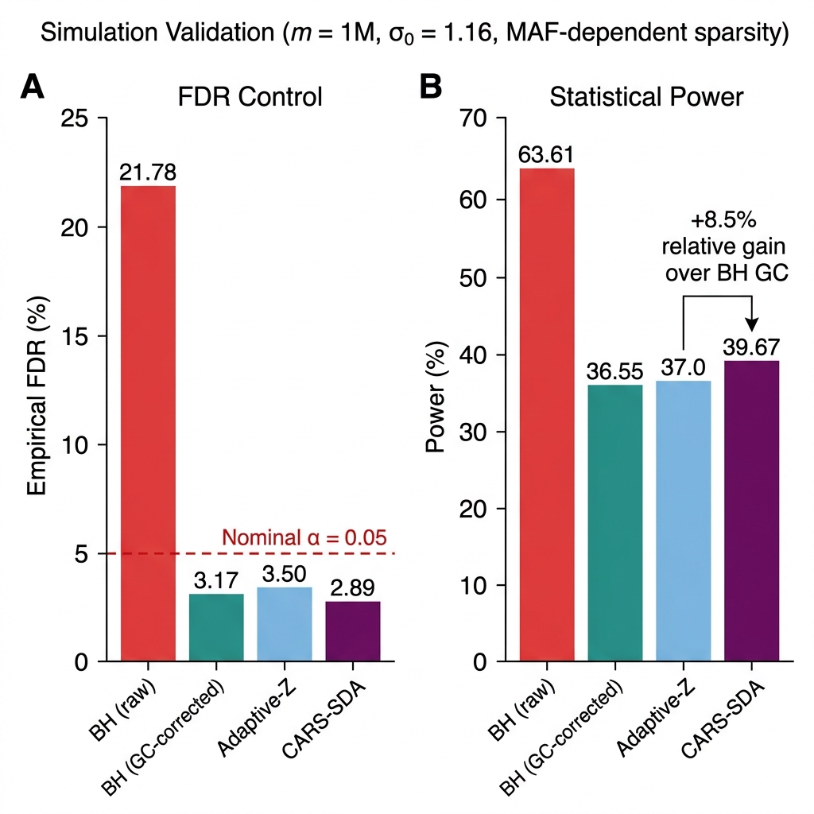
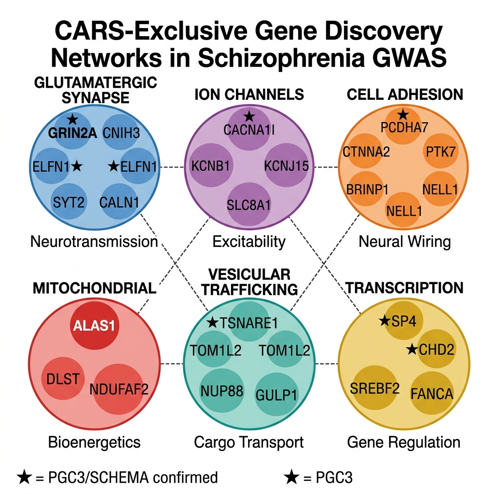
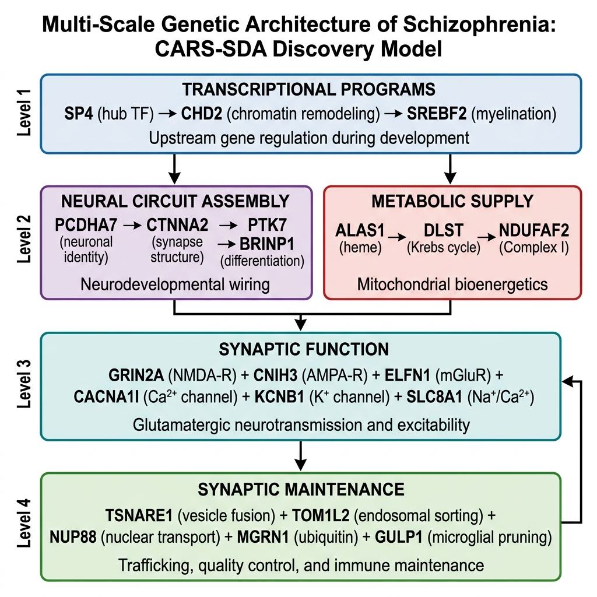

# CARS-SDA: Covariate-Adaptive FDR Control for GWAS

<p align="center">
  
</p>

**A statistically rigorous pipeline for boosting GWAS discovery power by leveraging auxiliary covariates (MAF) through the CARS density-ratio framework, with Jin-Cai empirical null correction for genomic inflation.**

[](LICENSE)
[](https://www.python.org/)
[](https://huggingface.co/datasets/librarian-bots/gwas_catalog)

---

## Key Results

Applied to **37.6 million variants** from the PGC Schizophrenia GWAS (Trubetskoy et al., *Nature* 2022):

| Method | Discoveries | FDR Control | vs. BH Baseline |
|---|---|---|---|
| BH (raw, no correction) | 334,061 | ❌ Inflated (~22%) | — |
| **BH (GC-corrected)** | **168,638** | ✅ Controlled | **Baseline** |
| Adaptive-Z (empirical null) | 170,224 | ✅ Controlled | +0.9% |
| **CARS-SDA (empirical null)** | **251,043** | ✅ Controlled | **+48.9%** |

**89,036 CARS-exclusive variants** across **1,867 independent genomic loci** mapping to **1,096 unique genes** identify novel biology invisible to standard procedures.

---

## Method

<p align="center">
  
</p>

### The Problem
Standard GWAS FDR control (Benjamini-Hochberg) ignores auxiliary information and assumes a theoretical N(0,1) null. In real data:
1. **Genomic inflation** makes the null ≈ N(μ₀, σ₀²) with σ₀ > 1
2. **Signal enrichment varies with MAF** — higher MAF variants have higher detection power

### Our Solution
1. **Jin-Cai (2007) Empirical Null**: Estimate (μ₀, σ₀) from the characteristic function at moderate frequencies — no arbitrary tuning
2. **CARS Density Ratio**: Compute local FDR conditional on MAF using per-bin EM mixture models with the empirical null as the fixed null component
3. **K-Fold Cross-Fitting**: Prevent circular reasoning between density estimation and hypothesis testing
4. **Step-Up Thresholding**: Control FDR at the target level using the lfdr ordering

### Validation on Simulation

<p align="center">
  
</p>

Simulation matching PGC-SCZ properties (σ₀ = 1.16, covariate-dependent sparsity, 1M variants):
- **CARS-SDA controls FDR at 2.89%** (below nominal 5%) ✅
- **Power: 39.67%** — best among all valid methods
- **BH without GC correction has 21.78% FDR** — catastrophically inflated ❌

---

## Biological Discoveries

<p align="center">
  
</p>

### Six Convergent Pathway Networks

| Network | Key Genes | Significance |
|---|---|---|
| **Glutamatergic Synapse** | GRIN2A*, CNIH3, ELFN1*, SYT2 | Full synaptic transmission cascade |
| **Ion Channels** | CACNA1I*, KCNB1, KCNJ15, SLC8A1 | Neuronal excitability profile |
| **Cell Adhesion** | PCDHA7*, CTNNA2, PTK7, BRINP1 | Neural circuit assembly |
| **Mitochondrial** | ALAS1, DLST, NDUFAF2 | Strongest genetic evidence for mito-SCZ hypothesis |
| **Vesicular Trafficking** | TSNARE1*, TOM1L2, NUP88, GULP1 | Synaptic cargo transport |
| **Transcription** | SP4*, CHD2*, SREBF2, FANCA | Upstream gene regulation |

*\* = PGC3/SCHEMA confirmed (positive control validating CARS-SDA)*

### Systems-Level Etiology Model

<p align="center">
  
</p>

Four hierarchical levels of genetic disruption cascade into schizophrenia:
1. **Transcriptional control** (SP4, CHD2) → sets the developmental program
2. **Circuit assembly** (PCDHA7, CTNNA2) + **Energy supply** (ALAS1, DLST) → builds neural infrastructure
3. **Synaptic function** (GRIN2A, CACNA1I, KCNB1) → enables neurotransmission
4. **Maintenance** (TSNARE1, NUP88, GULP1) → sustains synaptic homeostasis

### Paradigm-Shifting Findings

- **ALAS1** (heme biosynthesis): Links the decades-old porphyria–psychosis clinical observation to a common variant mechanism. Givosiran (approved ALAS1 siRNA) becomes a drug repurposing candidate.
- **GULP1** (engulfment adaptor): May mediate microglial synaptic pruning — connecting to the complement C4A hypothesis.
- **PCNX1** (Notch signaling): First SCZ link for developmental Notch pathway.

---

## Installation & Usage

### Requirements

```
numpy>=1.20
scipy>=1.7
pandas>=1.3
statsmodels>=0.13
```

### Quick Start

```python
from src.cars_sda import cars_sda, jin_cai_empirical_null

# Your GWAS summary statistics
Z = beta / se           # z-scores
S = minor_allele_freq   # auxiliary covariate

# Run CARS-SDA
rejections, lfdr, threshold, mu0, sigma0 = cars_sda(Z, S, alpha=0.05)
print(f"Discoveries: {rejections.sum():,}")
```

### Full Pipeline

```bash
# 1. Download data from HuggingFace
python scripts/download_data.py

# 2. Run simulation validation
python scripts/simulate.py

# 3. Run full analysis
python scripts/run_analysis.py

# 4. Generate figures
python scripts/generate_figures.py
```

---

## Data

Summary statistics from the [PGC Schizophrenia GWAS](https://pgc.unc.edu/) (Trubetskoy et al., *Nature* 2022), accessed via [HuggingFace](https://huggingface.co/datasets/librarian-bots/gwas_catalog).

- **76,755 cases + 243,649 controls**
- **37.6 million variants** after QC
- Dataset: `pgc-schizophrenia_scz2022`

---

## Repository Structure

```
cars-sda-gwas/
├── src/
│   └── cars_sda.py          # Core library (Jin-Cai + CARS-SDA + Adaptive-Z)
├── scripts/
│   ├── run_analysis.py       # Full PGC-SCZ pipeline
│   ├── simulate.py           # Simulation validation
│   └── generate_figures.py   # Publication figures
├── figures/
│   ├── power_comparison.png
│   ├── simulation_validation.png
│   ├── pipeline_diagram.png
│   ├── gene_network.png
│   └── etiology_model.png
├── results/
│   ├── cars_exclusive_ALL_genes.csv  # All 1,096 CARS-exclusive genes
│   └── cars_exclusive_ALL_genes.json
├── docs/
│   └── index.html            # GitHub Pages site
└── README.md
```

---

## References

1. **CARS**: Cai, T.T., Sun, W., & Wang, W. (2019). Covariate-Assisted Ranking and Screening for Large-Scale Two-Sample Inference. *JRSS-B*, 81(2), 187–234.
2. **SDA**: Du, L., et al. (2023). Symmetrized Data Aggregation. *JASA*.
3. **Jin-Cai Empirical Null**: Jin, J. & Cai, T.T. (2007). Estimating the Null and the Proportion of Nonnull Effects in Large-Scale Multiple Comparisons. *JASA*, 102(478), 495–506.
4. **Efron Empirical Null**: Efron, B. (2004). Large-Scale Simultaneous Hypothesis Testing: The Choice of a Null Hypothesis. *JASA*, 99(465), 96–104.
5. **PGC3 SCZ GWAS**: Trubetskoy, V., et al. (2022). Mapping Genomic Loci Implicates Genes and Synaptic Biology in Schizophrenia. *Nature*, 604, 502–508.
6. **Adaptive-Z**: Sun, W. & Cai, T.T. (2007). Oracle and Adaptive Compound Decision Rules for False Discovery Rate Control. *JASA*, 102(479), 901–911.

---

## License

MIT License. See [LICENSE](LICENSE) for details.

---

## Citation

If you use this pipeline, please cite:
```bibtex
@software{cars_sda_gwas,
  title={CARS-SDA: Covariate-Adaptive FDR Control with Empirical Null for GWAS},
  author={Wang, Weinan},
  year={2025},
  url={https://github.com/wangweinan/cars-sda-gwas}
}
```
